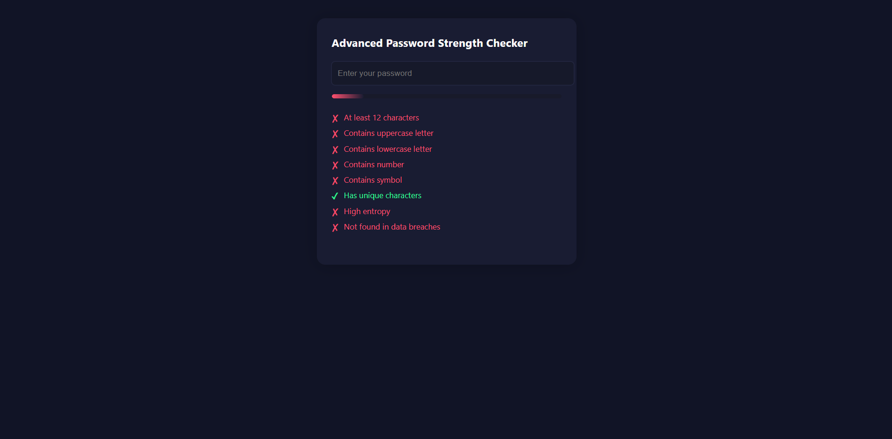

# Advanced Password Strength Checker

A modern, highly advanced password strength checker built with HTML, CSS, and JavaScript.  
It checks your password against multiple criteria and provides real-time feedback on strength, security, and whether it has ever appeared in data breaches.  

 <!-- Replace with your screenshot path if needed -->

---

## 🚀 Features

- **Live Password Strength Bar** with animated color feedback
- **Checks for:**
  - Minimum length (12+ characters)
  - Uppercase, lowercase, number, symbol
  - Uniqueness of characters
  - High entropy (bits of randomness)
  - Whether it has appeared in real-life data breaches ([HaveIBeenPwned](https://haveibeenpwned.com/API/v3#SearchingPwnedPasswordsByRange), privacy-safe)
- **Clear, modern UI** with easy-to-understand requirements
- **Responsive design** for desktop and mobile

---

## 📷 Preview

 <!-- Replace with your screenshot path if needed -->

---

## 🛠️ How to Use

1. **Clone or Download** this repository.
2. Open `index.html` in your web browser.
3. Start typing a password to see live feedback and advice.

---

## 📝 Customization

- **Colors and style:**  
  Edit `styles.css` to match your brand or preference.
- **Password policy:**  
  Adjust required entropy, minimum length, or requirements in `script.js`.

---

## 🔒 Security Note

- No passwords are ever sent to a remote server or stored anywhere.
- Data breach checks use a k-anonymity method: **your password is never uploaded**, only a portion of its hash is queried.

---

## 📄 License

MIT License.  
Feel free to use, modify, and share!

---

## 🙏 Acknowledgements

- [HaveIBeenPwned Pwned Passwords API](https://haveibeenpwned.com/API/v3#SearchingPwnedPasswordsByRange)
- [Color inspiration](https://coolors.co/)
